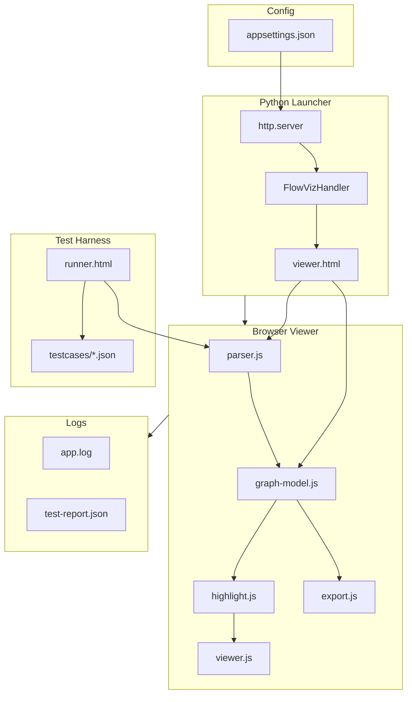

# 🧩 FlowViz アーキテクチャ構成図

```mermaid
flowchart TD
  subgraph Launcher [Python Launcher]
    A1[http.server] --> A2[FlowVizHandler]
    A2 --> A3[viewer.html]
  end
  subgraph App [Browser Viewer]
    A3 --> J1[parser.js]
    A3 --> J2[graph-model.js]
    J1 --> J2
    J2 --> J3[highlight.js]
    J2 --> J4[export.js]
    J3 --> J5[viewer.js]
  end
  subgraph Test [Test Harness]
    T1[runner.html] --> T2[testcases/*.json]
    T1 --> J1
  end
  subgraph Config
    C1[appsettings.json]
    C1 --> A1
  end
  subgraph Logs
    L1[app.log]
    L2[test-report.json]
  end
  Launcher --> App
  App --> Logs
```
